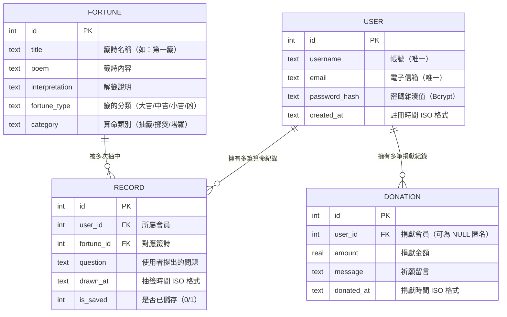

# 資料庫設計：線上算命系統

本文件根據 PRD、系統架構與流程圖，定義線上算命系統所需的 SQLite 資料表結構、欄位說明與關聯。

## 1. ER 圖（實體關係圖）

## 2. 資料表詳細說明

### 2.1 USER（使用者 / 會員）

儲存系統的註冊會員資料，用於登入驗證與紀錄歸屬。

| 欄位 | 型別 | 必填 | 說明 |
|------|------|------|------|
| `id` | INTEGER | ✅ | 主鍵，自動遞增 |
| `username` | TEXT | ✅ | 使用者帳號，不可重複 |
| `email` | TEXT | ✅ | 電子信箱，不可重複 |
| `password_hash` | TEXT | ✅ | 經 Bcrypt 雜湊後的密碼 |
| `created_at` | TEXT | ✅ | 註冊時間（ISO 8601 格式），預設為目前時間 |

- **Primary Key**: `id`
- **Unique Constraints**: `username`, `email`

---

### 2.2 FORTUNE（籤詩庫）

儲存系統中所有可供抽取的籤詩資料，為靜態資料表。

| 欄位 | 型別 | 必填 | 說明 |
|------|------|------|------|
| `id` | INTEGER | ✅ | 主鍵，自動遞增 |
| `title` | TEXT | ✅ | 籤詩名稱（如「第一籤」「上上籤」） |
| `poem` | TEXT | ✅ | 籤詩詩文內容 |
| `interpretation` | TEXT | ✅ | 白話解籤說明 |
| `fortune_type` | TEXT | ✅ | 吉凶分類（大吉 / 中吉 / 小吉 / 凶） |
| `category` | TEXT | ✅ | 算命類別（抽籤 / 擲筊 / 塔羅），預設為「抽籤」 |

- **Primary Key**: `id`

---

### 2.3 RECORD（算命紀錄）

儲存每一次使用者的抽籤/算命結果，關聯會員與籤詩。

| 欄位 | 型別 | 必填 | 說明 |
|------|------|------|------|
| `id` | INTEGER | ✅ | 主鍵，自動遞增 |
| `user_id` | INTEGER | ✅ | 外鍵，關聯 `USER.id` |
| `fortune_id` | INTEGER | ✅ | 外鍵，關聯 `FORTUNE.id` |
| `question` | TEXT | ❌ | 使用者提出的問題（可選） |
| `drawn_at` | TEXT | ✅ | 抽籤時間（ISO 8601 格式），預設為目前時間 |
| `is_saved` | INTEGER | ✅ | 是否已儲存至個人紀錄（0=否, 1=是），預設為 0 |

- **Primary Key**: `id`
- **Foreign Keys**: `user_id` → `USER.id`, `fortune_id` → `FORTUNE.id`

---

### 2.4 DONATION（香油錢捐獻紀錄）

儲存使用者的香油錢捐獻記錄，支援匿名捐獻。

| 欄位 | 型別 | 必填 | 說明 |
|------|------|------|------|
| `id` | INTEGER | ✅ | 主鍵，自動遞增 |
| `user_id` | INTEGER | ❌ | 外鍵，關聯 `USER.id`，匿名捐獻時為 NULL |
| `amount` | REAL | ✅ | 捐獻金額 |
| `message` | TEXT | ❌ | 祈願留言（可選） |
| `donated_at` | TEXT | ✅ | 捐獻時間（ISO 8601 格式），預設為目前時間 |

- **Primary Key**: `id`
- **Foreign Keys**: `user_id` → `USER.id`（允許 NULL）

## 3. SQL 建表語法

完整的 SQL 建表語法請參考 [`database/schema.sql`](../database/schema.sql)。
